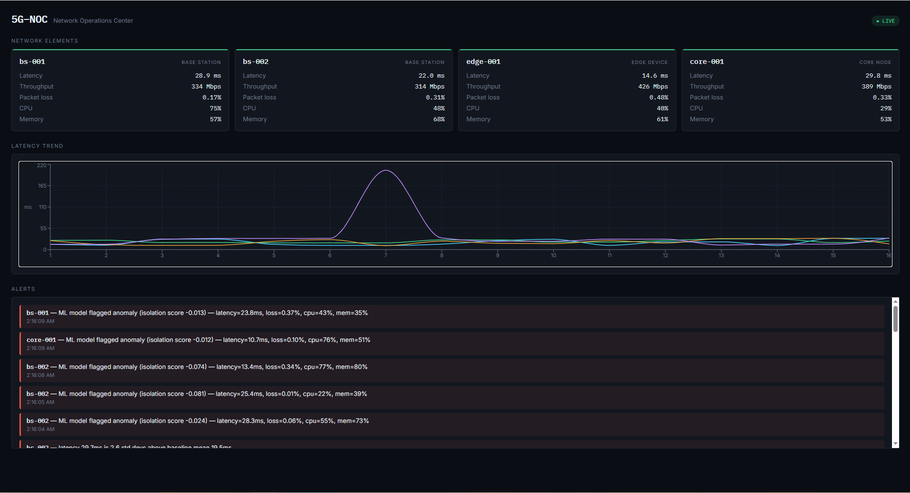

# 5G-NOC — 5G Network Operations Center

A cloud-native, real-time telecom network monitoring and analytics platform built in Go, simulating a 5G network operations environment with live telemetry, dual anomaly detection (statistical + ML), and a live monitoring dashboard.

Built as a hands-on exploration of the architecture patterns used in telecom network operations: concurrent telemetry ingestion, service-to-service communication (REST, gRPC, WebSockets), and proactive anomaly detection to reduce downtime.

---

## Live Demo


*(add your dashboard screenshot here before publishing)*

---

## Architecture

```
┌─────────────────────┐   gRPC    ┌──────────────────────┐
│ Telemetry Simulator  │ ────────► │  Telemetry Collector  │
│ (Go)                 │           │  (Go + SQLite)        │
│ Simulates 5G network  │           │  gRPC server :9090    │
│ elements as goroutines│           │  HTTP API    :8081    │
└──────────────────────┘           └───────────┬───────────┘
                                                │ HTTP (poll)
                       ┌────────────────────────┼────────────────────────┐
                       ▼                                                 ▼
          ┌────────────────────────┐                     ┌───────────────────────────┐
          │  Anomaly Engine (Go)    │                     │  Anomaly ML Service        │
          │  Rolling mean/stddev    │                     │  (Python FastAPI)          │
          │  per-element detection  │                     │  Isolation Forest model    │
          └────────────┬────────────┘                     └──────────────┬─────────────┘
                       │ POST /alerts                                   │ POST /alerts
                       └────────────────────────┬────────────────────────┘
                                                 ▼
                                    ┌─────────────────────────┐
                                    │   API Gateway (Go)       │
                                    │   WebSocket broadcast     │
                                    │   :8082                   │
                                    └─────────────┬─────────────┘
                                                  │ WebSocket
                                                  ▼
                                    ┌─────────────────────────┐
                                    │  React + TypeScript       │
                                    │  Live Dashboard            │
                                    │  :5173                     │
                                    └─────────────────────────┘
```

---

## Key Features

**Implemented:**
- Real-time simulation of multiple 5G network elements (base stations, core nodes, edge devices) using Go goroutines and channels
- Telemetry ingestion over **gRPC** (simulator → collector), with a legacy HTTP path kept for testing/debugging
- Persistent storage in SQLite, with a documented fix for SQLite's single-writer concurrency limitation
- **Dual anomaly detection**:
  - Go-based statistical detector (rolling mean + standard deviation, per-element baselines)
  - Python FastAPI service using **Isolation Forest** (multivariate, unsupervised ML) for detecting unusual combinations of metrics
- API Gateway broadcasting live telemetry and alerts to connected clients over **WebSockets**
- React + TypeScript dashboard with live-updating element cards, a real-time latency chart, and an alerts feed
- One-command local startup script (`start-all.ps1`)

**Planned / in progress:**
- Full Docker Compose setup (each service containerized, single `docker-compose up`)
- Prometheus metrics endpoint for service-level observability
- PostgreSQL as a production-ready alternative to SQLite
- CI pipeline (GitHub Actions) running `go build` / `go vet` on every push
- Graceful shutdown handling (SIGINT/SIGTERM) across services

---

## Tech Stack

| Layer | Technology |
|---|---|
| Core services | Go (goroutines, channels, `net/http`, `gorilla/websocket`) |
| Service communication | gRPC (simulator → collector), REST, WebSockets |
| Statistical anomaly detection | Go (rolling mean/stddev) |
| ML anomaly detection | Python, FastAPI, scikit-learn (Isolation Forest) |
| Storage | SQLite (single-writer safe pool) |
| Dashboard | React, TypeScript, Recharts |
| Tooling | Protocol Buffers, Git/GitHub |

---

## Why these design choices

**Statistical detection *and* ML detection, side by side.**
The Go engine is fast, dependency-free, and fully explainable — every alert states exactly which metric crossed how many standard deviations above baseline. The Python service catches a different class of problem: anomalies that only show up as an *unusual combination* of metrics (e.g., moderate latency + moderate packet loss + high CPU together, none of which alone would trip a single-metric threshold). Running both is a deliberate comparison, not redundancy.

**SQLite, with a known limitation documented rather than hidden.**
SQLite only supports one concurrent writer. Under load from four simulated network elements POSTing concurrently, this initially caused intermittent `database is locked` errors. Fixed by capping the connection pool to one (`db.SetMaxOpenConns(1)`), serializing writes. The tradeoff (throughput) and the production alternative (PostgreSQL, or SQLite WAL mode) are noted rather than glossed over.

**gRPC for simulator→collector, REST elsewhere.**
gRPC was added specifically on the highest-throughput, most latency-sensitive leg of the pipeline (continuous telemetry ingestion from multiple concurrent sources), while REST was kept for lower-frequency, human-debuggable paths (querying recent telemetry, posting alerts). This mirrors how real systems selectively adopt gRPC rather than using it everywhere by default.

---

## Getting Started

### Prerequisites
- [Go](https://go.dev/dl/) 1.22+
- [Node.js](https://nodejs.org/) 20+ (includes npm)
- [Python](https://www.python.org/downloads/) 3.11+
- [Protocol Buffers compiler](https://github.com/protocolbuffers/protobuf/releases) (`protoc`) — only needed if regenerating gRPC code

### Setup

```bash
git clone https://github.com/Parvez6084/5G-NOC.git
cd 5G-NOC
```

Each service manages its own dependencies:

```bash
# Go services
cd services/telemetry-collector && go mod tidy && cd ../..
cd services/telemetry-simulator && go mod tidy && cd ../..
cd services/api-gateway && go mod tidy && cd ../..
cd services/anomaly-engine && go mod tidy && cd ../..

# Python ML service
cd services/anomaly-ml
python -m venv venv
venv\Scripts\activate        # on Windows
pip install -r requirements.txt
cd ../..

# React dashboard
cd dashboard-react
npm install
cd ..
```

### Run everything

**Windows (one command):**
```powershell
.\start-all.ps1
```

**Manually, one service per terminal (any OS):**
```bash
# Terminal 1
cd services/telemetry-collector && go run main.go

# Terminal 2
cd services/telemetry-simulator && go run main.go

# Terminal 3
cd services/api-gateway && go run main.go

# Terminal 4
cd services/anomaly-engine && go run main.go

# Terminal 5
cd services/anomaly-ml
venv\Scripts\activate
uvicorn main:app --port 8083 --reload

# Terminal 6
cd dashboard-react && npm run dev
```

Open **http://localhost:5173** — the dashboard connects automatically over WebSocket and starts showing live telemetry and alerts within a few seconds.

---

## Project Structure

```
5G-NOC/
├── proto/                     # Shared gRPC/protobuf definitions
├── services/
│   ├── telemetry-simulator/   # Simulates 5G network elements (Go)
│   ├── telemetry-collector/   # gRPC + HTTP ingestion, SQLite storage (Go)
│   ├── anomaly-engine/        # Statistical anomaly detection (Go)
│   ├── anomaly-ml/            # Isolation Forest anomaly detection (Python/FastAPI)
│   └── api-gateway/           # WebSocket broadcast + REST (Go)
├── dashboard-react/           # Live monitoring dashboard (React + TypeScript)
├── start-all.ps1              # One-command local startup (Windows)
└── README.md
```

---

## What I learned building this

- Diagnosing and fixing a real SQLite concurrency bug under concurrent load
- Structuring a Go microservices project with shared internal modules (`replace` directives, local proto packages)
- Trading off REST vs. gRPC vs. WebSockets based on the actual communication pattern needed, rather than picking one protocol for everything
- Comparing an explainable statistical approach against an unsupervised ML model on the same real-time data stream
- Windows-specific tooling friction (PATH, PowerShell quoting, CGO-free driver choices) and how to work around it cleanly

---

## License

MIT
